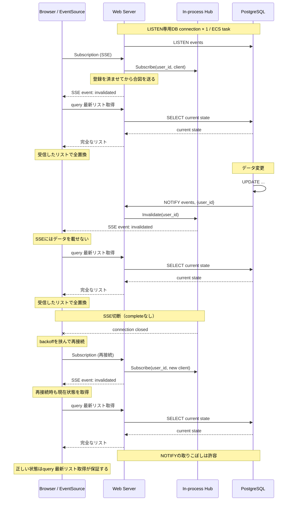

# SSEをinvalidation signalに切り替える

SSEでジョブ一覧を配るのをやめ、「取り直せ」という合図だけを送る。クライアントは合図を受けたら通常のqueryで一覧を取り直す。これにより、NOTIFYのfan-outに伴うHub内の負荷と並行処理の複雑さを構造ごと取り除く。本ドキュメントは設計の正本であり、実装計画はこれを入力にする。

## 設計上の原則

- PostgreSQLとのLISTEN接続は、Web ECS taskあたり1本とする。
- LISTEN channelは1つ。NOTIFY payloadには対象ユーザー等のrouting情報だけを含める。
- NOTIFYはデータ配送ではなく invalidation signal として扱う。
- SSEではデータ本体を送信せず、invalidated 等の通知だけ送信する。
- クライアントはinvalidationを受けたら通常のAPIから最新の完全なリストを取得する。
- クライアントは取得したリストでローカル状態を全置換する。イベントの差分適用・履歴管理は行わない。
- NOTIFYの取りこぼしは許容する。SSEの(再)接続直後にサーバーがinvalidationを1件送り、クライアントはそれを受けて最新状態をAPIから取得することで状態を収束させる。
- SSE接続の切断・再接続は正常系として扱う。
- Hubはイベント履歴を保持せず、現在接続中のSSE clientのroutingだけを担当する。
- SSE client切断時にはHubから必ずunsubscribeする。
- 特定clientの送信詰まりがHub全体をblockしないようにする。
- 同一対象への短時間の複数invalidationはcoalesceしてよい。

## シーケンス



## 検討経緯: 検証ブランチ案は持ち込まず、invalidation方式に切り替える

この方式を採ると、検証ブランチ（experiment/sse-fanout-loadtest）で実測した2つの改善はどちらも不要になる。代わりに、負荷の発生源がHubの内側からクライアントとAPIの間へ移る。以下はその比較と、移った負荷への対策、SSEを長時間保つためのインフラ側の前提をまとめたものである。

### 検証ブランチ案とは、解いている問題の層が違う

検証ブランチは「SSEでデータ本体を配る」設計を保ったまま、NOTIFYのfan-outで増える`JobStore.List`の呼び出しを減らす最適化だった。改善は2つあり、fix #1（dispatch時にuserIDあたり1回だけListする）でList呼び出しは5タブ×4イベントのベースライン20回から8回に減った。fix #2（NOTIFYチャンネルをuserID単位に分割する）では、無関係なプロセスが受け取るNOTIFYが0件になることをカウンタで確かめた。

本方式ではHubがデータを持たないので、fix #1が削っていた「Hub内での重複List」はそもそも起きない。fix #2も要らなくなる。単一チャンネルのままだと無関係なプロセスにもNOTIFYは届くが、そこで起きるのはroutingテーブルの参照だけでListは走らないため、配信されても安い。

実装の複雑さも大きく減る。検証中に見つかった並行処理の不具合（unsubscribeのロック順序、Subscribeとunsubscribeの間のABA問題）は、どれも「購読者の増減に合わせてLISTENを張り替え、正しいタイミングでListを呼ぶ」という要求から生じていた。LISTENが1本に固定され、Hubがルーティングだけを担えば、この種の競合の大半は発生源ごと消える。最終レビューで指摘された「古いスナップショットのまま止まる」バッファリングの後退も、invalidationにはデータが載らないので問題にならない。容量1のチャネルへ非ブロッキングで送る形にすれば、送信詰まりでHubを止めないことと、短時間の連続invalidationをまとめることが同じ仕組みで済むと見ている（未検証）。

引き換えに手放すのは配送保証である。NOTIFYの取りこぼしは許容し、気になったユーザーはリロードすれば最新になる、という前提を受け入れる。

### 新たなコスト(1): invalidationを受けるたびのqueryがタブ数に比例する

Hubの中でまとめていたList呼び出しは、本方式ではタブごとの個別queryとしてクライアント側から戻ってくる。対策として、visibilitychangeでタブが非表示になったらSSE接続を閉じ、表示に戻ったら再接続して1回queryし、状態を追いつかせる。処理を止めるだけにせず接続まで閉じるのは、前段のnginxの接続数も減らすためである（後述）。

この対策が効くのは「同一ユーザーが多数のタブを開いている」場合に限られる。すべてのタブが表示状態にある場合や、複数ユーザーがそれぞれ更新する場合（負荷がアクティブユーザー数に比例する）は減らせない。

### 新たなコスト(2): 再接続のたびにqueryが走る

クライアントがqueryを投げるきっかけは2種類ある。一つはinvalidationの受信で、頻度はジョブの更新頻度に比例する。もう一つはSSEの再接続で、こちらはネットワークの不安定さ、ロードバランサのタイムアウト、デプロイといった、更新とは無関係な要因で起きる。前者はvisibilitychangeで抑えられるが、後者には別の対策が要る。

デプロイはB/Gで0/100に切り替える想定である。この方式では旧環境の接続がすべて同じ時刻に切れ、全クライアントが一斉に再接続とqueryを投げてくる。対策は2つ組み合わせる。

- サーバー側: SIGTERMを受けたらSSE接続を能動的に閉じるgraceful shutdownを入れる。ただし閉じ方に注意が要る（後述「実装上の決定」）。
- クライアント側: 再接続にジッター付きのexponential backoffを入れ、再接続の波を時間方向に散らす。B/Gでは新環境が切り替え前にヘルスチェックを通っているので、起動待ちは考えなくてよい。ジッター幅は、新環境が受け止められる程度まで負荷を散らす値として決める。

### タイムアウトは「アイドル型」と「寿命型」を分けて考える

SSE接続を長く保てるかどうかは、経路上のタイムアウトの性質で決まる。

アイドル型は「一定時間データが流れなければ切る」タイムアウトで、ALBの[接続アイドルタイムアウト](https://docs.aws.amazon.com/elasticloadbalancing/latest/application/edit-load-balancer-attributes.html#connection-idle-timeout)やnginxの[`proxy_read_timeout`](https://nginx.org/en/docs/http/ngx_http_proxy_module.html#proxy_read_timeout)（どちらも既定60秒）がこれにあたる。こちらはpingで延命できる。ALBのドキュメントも、長く続く処理ではアイドルタイムアウトが切れる前に少なくとも1バイト送るよう勧めている。ALBはHTTP/2のPINGフレームではタイマーをリセットしないが、gqlgenのpingはレスポンス本文に書くコメント行なので、データとして数えられる。経路（クライアント→ALB→Proxy→アプリ）の実質的なタイムアウトは各区間の最小値で決まるので、ping間隔はその1/3以下にする。既定の60秒なら20秒以下で、`KeepAlivePingInterval`は15〜20秒、現状の10秒のままでもよい。gqlgenのpingは`: ping\n\n`というコメント行で、データを送るたびにタイマーがリセットされるため、無通信のときにしか出ない。

ping間隔には、切断に気づくまでの時間の上限という役割もある。Proxyを挟むとクライアントの切断がアプリまですぐ伝わるとは限らないが、pingの書き込みが失敗すれば確実に検知でき、Hubからunsubscribeできる。間隔を伸ばしすぎると、切断済みの購読がHubに残る時間もそのぶん延びる。

寿命型は「接続開始からN秒で切る」タイムアウトで、pingをいくら送っても効かない。代表例はEnvoyの[ルートタイムアウト](https://www.envoyproxy.io/docs/envoy/latest/api-v3/config/route/v3/route_components.proto#envoy-v3-api-field-config-route-v3-routeaction-timeout)（既定15秒）で、上流のレスポンスが最後まで処理されるまでの時間の上限になっている。経路に寿命型があり、Proxyの設定も変えられない場合に限って、クライアントが期限前に自分から接続を張り直す。直前まで接続は正常に生きていたので、張り直しのたびにqueryはしない。ALBやProxyの設定を変えやすい環境なら、そちらで伸ばすほうを選ぶ。

### nginxのバッファリングは、アプリ側のヘッダーで止める

nginxは既定で[`proxy_buffering on`](https://nginx.org/en/docs/http/ngx_http_proxy_module.html#proxy_buffering)になっている。上流がPHP-FPMのような「1リクエスト＝1プロセス」型だった時代の設計で、目的は上流の占有時間を短くすることにある。上流からのレスポンスを素早くバッファに吸い上げてプロセスとDB接続を解放し、遅いクライアントへの送出はnginx自身の軽いイベントループが引き受ける。SSEではこれが裏目に出る。数バイトのpingやイベントがバッファに留まって下流に流れず、ALBから見ると無通信のままになり、ping間隔が正しくても60秒で切られる。上流がGoならgoroutineは安価で、上流を早く解放したいという動機もそもそも弱い。

Proxyが他サービスと共有されていて設定を変えにくくても、アプリがレスポンスに`X-Accel-Buffering: no`を付ければ、nginxはそのレスポンスだけバッファリングを止める。gqlgenの`transport.SSE`はこのヘッダーを付けないので、SSE transportを埋め込んで`Do`だけを差し替える。

```go
type sseTransport struct {
	transport.SSE
}

func (t sseTransport) Do(w http.ResponseWriter, r *http.Request, exec graphql.GraphExecutor) {
	w.Header().Set("X-Accel-Buffering", "no")
	t.SSE.Do(w, r, exec)
}
```

`Supports`は埋め込み元のものがそのまま使われるので、SSEかどうかの判定をgqlgenと二重に持たずに済み、ヘッダーもSSEのレスポンスにだけ付く。gqlgenのextension（`AroundResponses`など）は`http.ResponseWriter`に触れられないので、この用途には使えない。net/httpのmiddlewareでAcceptヘッダーを見て付ける方法もあるが、判定ロジックが重複するので採らない。

### 共有nginxの接続数は、非表示タブの接続を閉じて抑える

nginxを他サービスと共有していると、SSEの長時間接続が他サービスの取り分を食う。効いてくる上限はメモリではなく[`worker_connections`](https://nginx.org/en/docs/ngx_core_module.html#worker_connections)（1ワーカーあたりの同時接続数、既定512）である。この数にはクライアントとの接続だけでなく上流との接続も含まれ、実際の上限はファイルディスクリプタ数の上限でも頭打ちになる。

nginxを経由するSSEは、1本につきクライアント側と上流側の2接続を使う。4ワーカー×1024接続なら、全サービス合わせて同時に中継できるのは約2000リクエストになる。通常のリクエストは短時間で接続を返すが、SSEは数十分にわたって握り続ける。ユーザー1000人がそれぞれ2タブ開けばそれだけで上限に届き、上限に達すると、同居する全サービスで新しい接続が受け付けられなくなる。クライアント側がHTTP/2なら、同じブラウザのタブは1本の接続にまとまる。それでも上流側はSSE 1本ごとに1接続を使うので、上流側の接続数はSSEの本数のまま減らない。

隔離の手段は3つ検討した。

- nginxには触らず、接続数そのものを減らす（非表示タブの接続を閉じる）。
- SSEのlocationに[`limit_conn`](https://nginx.org/en/docs/http/ngx_http_limit_conn_module.html#limit_conn)を掛け、SSEの総数に上限を設ける。
- ALBのリスナールールの[HTTPヘッダー条件](https://docs.aws.amazon.com/elasticloadbalancing/latest/application/rule-condition-types.html#http-header-conditions)で、`Accept`が`*text/event-stream*`のリクエストだけをSSE専用のターゲットグループに振り分け、nginxを通さない。

採るのは1つ目だけにする。nginxは設定を変えにくく、この先も使い続けるとは限らない。2つ目と3つ目はnginxがある前提の対策なので、nginxがなくなれば役目を終える。1つ目はアプリ自身の振る舞いなので、前段のProxyが何に替わっても効き続ける。

引き換えに、1つ目で下がるのは平均の接続数だけで、上限は掛からない。表示中のタブが多い、あるいはユーザー数が多いといった最悪のケースでは、nginxが残っている間は他サービスを巻き込むリスクが残る。このリスクは受け入れる。

## 方針

- NOTIFYはinvalidation signalとし、検証ブランチの実装（`Hub[T]`のジェネリクス化、dispatch集約、チャンネル分割）は持ち込まない。
- NOTIFYの取りこぼしは許容し、回復はリロードと再接続時のqueryに任せる。
- タブが非表示になったらvisibilitychangeでSSE接続を閉じ、表示に戻ったらすぐ再接続する。
- SIGTERMを受けたらSSE接続を閉じるgraceful shutdownを入れる。
- 切断されたあとのクライアントの再接続にジッター付きのexponential backoffを入れる。タブが表示に戻ったときの再接続は、待たずにすぐ行う。
- `KeepAlivePingInterval`は現状の10秒のままとする（15〜20秒に伸ばしてもよい）。
- SSE transportをラップし、`X-Accel-Buffering: no`を付ける。
- 経路にアイドル型のタイムアウトしかなければ、pingとALB・Proxy側の設定で対応する。寿命型があって設定を変えられない場合に限り、クライアントが期限前に自分から再接続する（queryはしない）。

## 実装上の決定

方針を今のコードに落とす際に決めたことをまとめる。実装の範囲はアプリ側だけで、ALB、B/Gデプロイ、nginxは本リポジトリに存在しないため対象外とし、上の記述を前提として残す。

### 既存のHubはそのまま使える

main上の`pgpubsub.Hub`は、すでにLISTEN 1本・単一チャンネル・ペイロードはuserID・容量1のチャネルへの非ブロッキング送信という形になっている。「Hubはルーティングだけ」「送信詰まりでHubを止めない」「連続invalidationをまとめる」はこれで満たされる。変えるのは購読のresolverで、通知のたびに`JobStore.List`を呼んで一覧を返している部分をinvalidationの送出に置き換える。Hubのコメントのうち、受信側が一覧を取り直す前提で書かれた箇所は実態に合わせる。

### スキーマは`jobsInvalidated: Boolean!`にする

購読フィールド`jobStatuses: [Job!]!`を削除し、`jobsInvalidated: Boolean!`を追加する。値は常に`true`で、意味は「一覧を取り直せ」だけである。クライアントはこのリポジトリのフロントエンドだけなので、互換性は保たない。将来ペイロードを足せるオブジェクト型にはしない。載せないことが原則だからだ。

### 接続直後にinvalidationを1件送る

resolverは、Hubへの登録を済ませてからすぐにinvalidationを1件送る。登録を先に済ませるので、取りこぼしの隙間ができない。登録より前の更新は直後の取得で拾え、登録より後の更新は別のinvalidationとして必ず届く。

この1件には理由がもう一つある。graphql-sseのクライアントは、結果を1件受け取ったときにだけ再試行の回数カウンタを0に戻す。invalidationはめったに届かないので、接続直後に何も送らないと、何も受け取らないまま切断が積み重なって再試行の上限に達しうる。接続直後の1件がカウンタのリセットを兼ねる。

クライアントは初回表示もこの経路で行い、購読の前にqueryはしない。初回接続、再接続、タブ復帰のどれもが「購読する→invalidationが届く→queryする」という同じ経路を通る。

### graceful shutdownでは`complete`を送らずに切る

gqlgenのSSE transportは、購読のチャネルが閉じると`event: complete`を送る。graphql-sseのクライアントは`complete`を受け取ると購読が正常に終わったと判断し、再接続しない。そのため、SIGTERMでresolverのcontextをキャンセルして行儀よく閉じると、クライアントの購読は黙って終わり、画面が更新されなくなる。

そこで、`http.Server.Shutdown`を5秒のタイムアウトで呼んで通常のリクエストの完了を待ち、タイムアウトしたら`http.Server.Close`で残った接続を強制的に切る。SSEの接続は待機状態にならないので、必ずこの強制切断の側に回る。`complete`が届かないまま接続が切れるので、クライアントはネットワークエラーとして扱い、backoffを挟んで再接続する。5秒はECSの`stopTimeout`の既定値30秒より十分短い。

### クライアントは表示中なら常に購読している状態を保つ

購読の開け閉めと再取得は、ジョブ一覧を表示するコンポーネントのRxJSパイプラインに書く。購読を使う画面が一つしかないので、専用サービスには切り出さない。タブの表示状態を流すObservableだけは関数に切り出し、テストで差し替えられるようにする。

- タブが非表示になったら購読を閉じ、表示に戻ったらすぐ購読し直す。
- 表示中に購読が終わったら（`complete`でもエラーでも）、backoffを挟んで購読し直す。サーバーが想定外の経路で`complete`を送っても、表示中のタブが購読を失わないようにするためである。
- invalidationを受けるたびに、`switchMap`で`fetchPolicy: 'network-only'`のqueryを走らせ、結果で表示を全部置き換える。実行中のqueryは新しいinvalidationで捨てられるので、最後に届いたinvalidationのあとに始まった取得の結果が必ず画面に残る。

### 再試行は回数無制限、待ち時間に上限を付ける

graphql-sseの既定の再試行は最大5回で、使い切ると購読がエラーで終わる。待ち時間は1秒×2^n＋0.3〜3秒のジッターで上限がない。これを、回数無制限・待ち時間の上限30秒・ジッター0.3〜3秒の関数に差し替える。同じ関数を、上の「購読が終わったときの張り直し」の間隔にも使う。

### テスト

- バックエンド
  - resolverの単体テストで、購読した直後に1件届くこと、Hubの通知のたびに1件届くことを確かめる。
  - 実際のSSEをつなぐe2eで、接続直後と更新時のinvalidation、`X-Accel-Buffering: no`ヘッダーを確かめる。
  - シャットダウン処理を`cmd/main.go`から関数に切り出し、強制的に閉じたときにSSEのストリームに`event: complete`が現れないまま切れることをe2eで確かめる。
- フロントエンド（vitest）
  - invalidationのたびにqueryが走り、表示が置き換わること。
  - 非表示で購読が閉じ、表示に戻ると購読し直すこと。
  - `complete`のあとに購読し直すこと。
  - 連続したinvalidationで、最後の取得の結果が残ること。
  - backoffの待ち時間が上限を超えないこと。
- 手動：ブラウザで、タブの切り替え、サーバーの再起動、DevToolsでの接続の様子を確かめる。

## 未解決の論点と、今回は持ち込まないもの

- pingの途絶検知: 接続は生きているように見えてデータが届かない状態を、クライアントがpingの途絶で見つけて再接続する仕組み。どの程度の頻度で途絶が起きるかがまだ分からないので、今回は入れない。実際に途絶を観測してから判断する。
- SSEのパス分離: 現状はSSEも`/query`上でAcceptヘッダーによって振り分けている。共有Proxyで区間ごとの設定が必要になったら、`/query/stream`のように分けるとそのパスだけに設定を足せる。今は必要ないと見ている。
- 共有Proxyの[`proxy_ignore_headers`](https://nginx.org/en/docs/http/ngx_http_proxy_module.html#proxy_ignore_headers): ここに`X-Accel-Buffering`が含まれていると、ヘッダーは無視される。導入時にProxyの管理者へ確認する。
- アクティブユーザー数に比例するquery負荷: visibilitychangeでは減らせない。現状の規模ではクライアント側のデバウンスは不要と見ているが、負荷が見えてきたら再検討する。
- 共有nginxの接続数の上限: SSEの本数に上限を掛ける手段は持たない。nginxが長く残ることが決まり、接続数が実際に問題になったら、nginxを迂回するALBのヘッダー条件ルールを最初の候補にする。タブ間でリーダーを選んでブラウザ全体のSSEを1本にする手（BroadcastChannelとWeb Locks）もあるが、実装が重くなるので今は採らない。
- ジッターとbackoffの具体的な値: 今回はgraphql-sseの既定と同じジッター（0.3〜3秒）に上限30秒を足しただけである。B/G切り替え時に新環境が受け止められる負荷から逆算した値にはまだなっていない。
