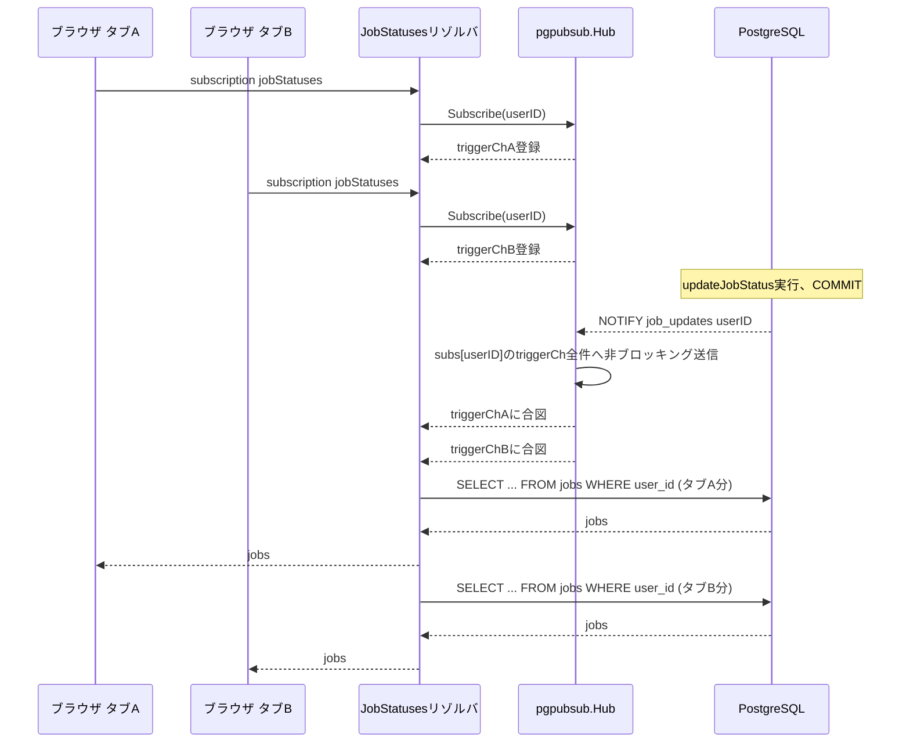
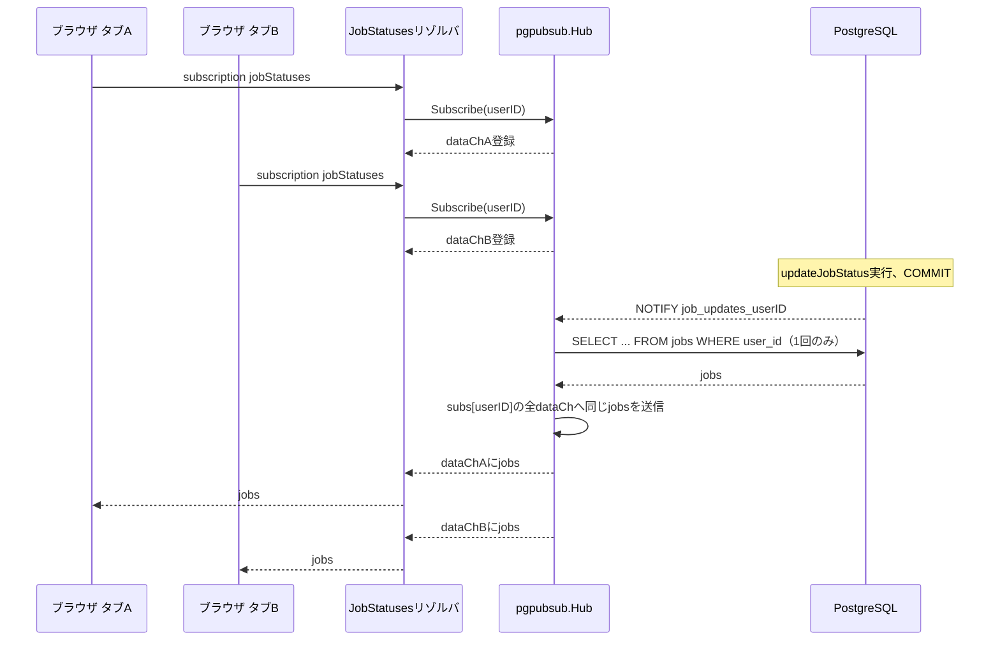

# SSE Fan-out 負荷検証の実測結果

[docs/20260919-sse-fanout-load-analysis.md](./20260919-sse-fanout-load-analysis.md)で検討した2案の効果を、実際に検証環境を構築して定量的に確認した記録。検証用のコードは`experiment/sse-fanout-loadtest`ブランチにあり、mainにはマージしない使い捨てである。

## 検証環境

- 複数ユーザー: `backend/userctx/userctx.go`を`X-User-Id`ヘッダー対応に拡張（本番の認証機構ではない）
- 複数タブ: `backend/cmd/loadtest`が複数のSSE接続を並列に張る
- 複数プロセス: 同一マシンで`PORT`を変えて`go run ./cmd`を複数回起動
- 測定: `pg_stat_statements`（一次証拠）と`CountingJobStore`経由の`/debug/loadtest-stats`（プロセスごとの内訳）を併用

## 1. ベースライン計測（改善前）

条件: タブ5枚、単一プロセス、updateJobStatus 3回、間隔2秒。

コマンド:

```
cd backend
go run ./cmd/loadtest -tabs=5 -processes=http://localhost:8080 -updates=3 -interval=2s
```

標準出力（該当部分）:

```
=== 結果 ===
タブ数: 5, 更新回数: 3, ユーザー: loadtest-user-1790156077645583207

--- 各タブの受信回数 ---
タブ0 (接続先 http://localhost:8080): 4回受信
タブ1 (接続先 http://localhost:8080): 4回受信
タブ2 (接続先 http://localhost:8080): 4回受信
タブ3 (接続先 http://localhost:8080): 4回受信
タブ4 (接続先 http://localhost:8080): 4回受信

--- 各プロセスのList呼び出し回数（累積） ---
http://localhost:8080: map[loadtest-user-1790156077645583207:20]
```

`pg_stat_statements`（`pg_stat_statements_reset()`実行直後にloadtestを実行）:

```
                              query                               | calls
------------------------------------------------------------------+-------
 SELECT id, name, status FROM jobs WHERE user_id = $1 ORDER BY id |    20
(1 row)
```

- 各タブの受信回数: タブ0〜4がそれぞれ4回受信（初回スナップショット1回 + updateJobStatus 3回分）
- `/debug/loadtest-stats`のList呼び出し回数: `loadtest-user-1790156077645583207`: 20回
- `pg_stat_statements`の`SELECT ... FROM jobs WHERE user_id`のcalls: 20回

**観察:** アプリ側カウンタ（20回）とDB側の`calls`（20回）が完全に一致した。内訳はタブ数5 × (初期スナップショット1回 + updateJobStatus 3回) = 5 × 4 = 20回であり、仮説どおり「1回の`updateJobStatus`ごとにタブの本数分だけ`JobStore.List`が呼ばれる」構造になっている。初期接続時のスナップショット取得も同じ`List`を経由するため、更新3回だけでなく接続時点でも1タブにつき1回加算される点に注意。タブ数を増やすほど、更新1回あたりのDBアクセス数がタブ数に比例して増える（N倍化）ことが実測で確認できた。

## 2. dispatch時1回List化後の計測

条件: タブ5枚、単一プロセス、updateJobStatus 3回、間隔2秒（ベースラインと同一条件）。

コマンド:

```
cd backend
go run ./cmd/loadtest -tabs=5 -processes=http://localhost:8080 -updates=3 -interval=2s
```

標準出力（該当部分）:

```
=== 結果 ===
タブ数: 5, 更新回数: 3, ユーザー: loadtest-user-1790157151394593316

--- 各タブの受信回数 ---
タブ0 (接続先 http://localhost:8080): 4回受信
タブ1 (接続先 http://localhost:8080): 4回受信
タブ2 (接続先 http://localhost:8080): 4回受信
タブ3 (接続先 http://localhost:8080): 4回受信
タブ4 (接続先 http://localhost:8080): 4回受信

--- 各プロセスのList呼び出し回数（累積） ---
http://localhost:8080: map[loadtest-user-1790157151394593316:8]
```

`pg_stat_statements`（`pg_stat_statements_reset()`実行直後にloadtestを実行）:

```
                              query                               | calls
------------------------------------------------------------------+-------
 SELECT id, name, status FROM jobs WHERE user_id = $1 ORDER BY id |     8
(1 row)
```

- 各タブの受信回数: タブ0〜4がそれぞれ4回受信（初回スナップショット1回 + updateJobStatus 3回分）。ベースラインと同じ受信回数であり、Hub変更後もクライアント体験（受信イベント数）は変わっていない。
- `/debug/loadtest-stats`のList呼び出し回数: `loadtest-user-1790157151394593316`: 8回
- `pg_stat_statements`の`SELECT ... FROM jobs WHERE user_id`のcalls: 8回

**観察:** アプリ側カウンタ（8回）とDB側の`calls`（8回）が完全に一致し、事前予測（更新3回+初期スナップショット5回=8回前後）とも一致した。ただし内訳を`graph/schema.resolvers.go`と`pgpubsub/hub.go`のコードで確認すると、「8回」の内実は2種類の異なる経路から来ている。更新3回分は`pgpubsub.Hub.dispatch`経由でuserIDあたり1回ずつ呼ばれており、ここがTask 7の修正（タブ数に関わらず1回化）が効いている箇所である。一方、初期スナップショット5回分は`JobStatuses`サブスクリプション開始時に呼ばれる`r.JobStore.List`の直接呼び出しに由来し、これは`Hub.dispatch`を経由しないためTask 7の修正の対象外であり、タブごとに1回ずつ、つまりタブ数分そのまま残っている。ベースライン（20回 = タブ数5 × (初期スナップショット1回+更新3回)）と比べると、更新3回分がタブ数5倍から1倍に減った効果でtotalは20→8（60%減）になった。タブ数を増やしても「更新1回あたりのList呼び出し」は1回のまま増えなくなった一方、「購読開始時の初期スナップショット取得」はタブ数に比例して増え続ける点は今回の改善の対象外として残っている。

## 3. チャンネルのuserID単位分割後の計測

条件: プロセスA（ポート8080）にuser-shard-aのタブ3本を接続。プロセスB（ポート8081）はuser-shard-aの接続を一切持たない。updateJobStatus 2回。`LOADTEST_SHARDED_HUB=true`でプロセスA・Bともに起動し、`loadtestutil.ShardedNotifyJobStore`（`job_updates_sharded_<userID>`チャンネルへのNOTIFY）と`loadtestutil.ShardedHub`（同チャンネルのLISTEN）を配線した。

**留意点（配線の制約）:** `LOADTEST_SHARDED_HUB=true`の配線では、resolverの`JobStore`（`updateJobStatus`ミューテーション経由の直接更新）だけが`shardedNotifyStore`に差し替えられている。`backend/cmd/main.go`の非同期ワーカー完了経路（`consumer.Run`）は`countingJobStore`（従来の単一`job_updates`チャンネルへのNOTIFYのみ行う実装）のまま配線されており、rewireされていない。そのため、sharded modeであってもワーカー経由の完了通知（workersim/consumer経由）はSSEクライアントに届かない構成になっている。今回の実験ではsharded modeの計測時にworkersim/consumerを一切使わず、`updateJobStatus`ミューテーションのみで更新を発生させているため、この配線ギャップは今回のどの計測結果にも影響していない。ただし本番相当の構成に持ち込む場合は、`consumer`側の通知先も`shardedNotifyStore`相当に揃える必要がある未解決の課題として残る。

起動コマンド（プロセスA、ポート8080）:

```
cd backend
direnv exec . env PORT=8080 LOADTEST_SHARDED_HUB=true AWS_ENDPOINT_URL=http://localhost:14566 go run ./cmd
```

起動コマンド（プロセスB、ポート8081）:

```
cd backend
direnv exec . env PORT=8081 LOADTEST_SHARDED_HUB=true AWS_ENDPOINT_URL=http://localhost:14566 go run ./cmd
```

両プロセスの起動ログ（該当部分、同一）:

```
loadtest: using ShardedHub (userID単位のNOTIFYチャンネル分割)
connect to http://localhost:<port>/ for GraphQL playground
```

`pg_stat_statements_reset()`実行後、loadtestクライアントをプロセスAにのみ接続:

```
cd backend
go run ./cmd/loadtest -tabs=3 -processes=http://localhost:8080 -updates=2 -interval=2s -user=user-shard-a
```

標準出力（該当部分）:

```
=== 結果 ===
タブ数: 3, 更新回数: 2, ユーザー: user-shard-a

--- 各タブの受信回数 ---
タブ0 (接続先 http://localhost:8080): 3回受信
タブ1 (接続先 http://localhost:8080): 3回受信
タブ2 (接続先 http://localhost:8080): 3回受信

--- 各プロセスのList呼び出し回数（累積） ---
http://localhost:8080: map[user-shard-a:9]
```

プロセスAとプロセスBの`/debug/loadtest-stats`:

```
$ curl -s http://localhost:8080/debug/loadtest-stats
{"list_call_counts_by_user":{"user-shard-a":9}}

$ curl -s http://localhost:8081/debug/loadtest-stats
{"list_call_counts_by_user":{}}
```

プロセスBのログ全体（NOTIFY受信やdispatch関連のログ・エラーが一切出ていないことの確認）:

```
loadtest: using ShardedHub (userID単位のNOTIFYチャンネル分割)
connect to http://localhost:8081/ for GraphQL playground
```

`grep -i "wait for notification\|dispatch" /tmp/loadtest-process-8081-sharded.log`の結果: 一致行なし。`grep -i "error\|panic"`の結果も一致行なし。

- プロセスAのList呼び出し回数: `user-shard-a`: 9回。この時点（Task 10）の`ShardedHub`はまだTask 12のdispatch集約ロジックを持っておらず、`Subscribe`呼び出しごとに独立して`List`が呼ばれる実装だった。そのため内訳は「初期スナップショット: タブ3本 × 1回 = 3回」+「更新2回分: タブ3本 × 2回 = 6回」で3+6=9回であり、初期スナップショットだけでなく更新分もタブ数に比例したまま残っている。これはfix #1（dispatch時1回化）の効果を全く継承していないことを示す。「タブ3 × (初期スナップショット1 + 更新2) = 3 × 3 = 9」という式は一見同じ9という数字になるが、これは更新分がタブ数倍のまま9に達している式であり、fix #1適用後の「更新分は1回に集約され、初期スナップショット分だけがタブ数に比例する」という構造（Section 2の8回=更新3(集約済み)+初期スナップショット5）とは全く異なる。チャンネル分割（fix #2）とdispatch集約（fix #1）は独立した性質であり、`ShardedHub`が前者を実現しても後者を自動的には継承しないことを、この9回という実測値が示している。
- プロセスBのList呼び出し回数: `user-shard-a`: 記録なし（`/debug/loadtest-stats`が`{}`のまま） — 期待どおり0回

**観察:** プロセスBの`/debug/loadtest-stats`が`{}`のまま変化しないことから、少なくとも`List`呼び出しは発生していないことを確認した。ただし、この時点の証拠（`/debug/loadtest-stats`が空であること、およびプロセスBのログに`wait for notification`や`dispatch`という文字列が出現しないこと）は、実は単一チャンネル方式とShardedHub方式を区別する決定的な証拠にはならない。単一チャンネル方式でもプロセスBに購読者がいなければ`List`は呼ばれない（`dispatch`はuserID一致かつ購読者ありの場合のみ`List`を呼ぶ）ため、この段階での「Bの`List`呼び出し0回」はどちらの設計でも成立し得る。さらに、両方の`Hub`実装ともNOTIFY受信に成功したときは何もログ出力しない（エラー時のみログを出す）ため、「ログに何も出ていないこと」は「NOTIFYが届いていないこと」の証明にはならない。この区別を実際につけるための計測は、後述のSection 6（NOTIFY受信件数カウンタによる検証）で行った。

## 4. 改善前後の接続関係

### 4.1 改善前（単一チャンネル、dispatch時に購読者数分List）



タブの本数だけ`SELECT ... FROM jobs WHERE user_id`が発行される。

### 4.2 改善後（dispatch時1回List、userID単位チャンネル分割）



タブの本数に関わらず、1回の更新につき`SELECT ... FROM jobs WHERE user_id`は1回だけ発行される。チャンネルをuserID単位に分割しているため、無関係なユーザー宛のNOTIFYはこのプロセスに一切届かない。

（補足: 上記の図は`pgpubsub.Hub`（単一チャンネル・dispatch集約）の構造を示しているが、Task 12でチャンネル分割側の`ShardedHub`にも同じdispatch集約ロジックを移植したため、`Hub`を`ShardedHub`に、`job_updates_userID`を`job_updates_sharded_userID`に読み替えれば、userIDごとに独立したチャンネルを使いながら同じ集約効果を持つ構成として、この図はそのまま成立する。Task 10時点の`ShardedHub`はこの集約ロジックを持たず、購読者ごとに独立して`List`を呼んでいたため、この図が示す挙動とは異なっていた。）

## 5. fix #1 + fix #2 組み合わせ後の計測

Task 10までの計測で、ShardedHub（fix #2）は無関係プロセスへの配信を防ぐ効果を持つ一方、同一プロセス内でのタブ数比例の重複List呼び出し（fix #1が解決する問題）を継承していないことが判明した。このセクションでは、ShardedHubにfix #1のdispatch集約ロジックを移植し、両方の効果が同時に成立することを計測で確認する。

条件: プロセスA（ポート8080）にタブ5本を接続、プロセスB（ポート8081）は同じユーザーの接続を持たない。updateJobStatus 3回。

```
$ docker compose up -d
 Container sse-fanout-loadtest-redis-1 Starting
 Container sse-fanout-loadtest-kumo-1 Starting
 Container sse-fanout-loadtest-postgres-1 Starting
 Container sse-fanout-loadtest-redis-1 Started
 Container sse-fanout-loadtest-kumo-1 Started
 Container sse-fanout-loadtest-postgres-1 Started

$ cd backend
$ direnv exec . env PORT=8080 LOADTEST_SHARDED_HUB=true AWS_ENDPOINT_URL=http://localhost:14566 go run ./cmd > /tmp/loadtest-process-8080-combined.log 2>&1 &
$ direnv exec . env PORT=8081 LOADTEST_SHARDED_HUB=true AWS_ENDPOINT_URL=http://localhost:14566 go run ./cmd > /tmp/loadtest-process-8081-combined.log 2>&1 &
$ cat /tmp/loadtest-process-8080-combined.log
2026/09/23 21:18:27 loadtest: using ShardedHub (userID単位のNOTIFYチャンネル分割)
2026/09/23 21:18:27 connect to http://localhost:8080/ for GraphQL playground
$ cat /tmp/loadtest-process-8081-combined.log
2026/09/23 21:18:37 loadtest: using ShardedHub (userID単位のNOTIFYチャンネル分割)
2026/09/23 21:18:37 connect to http://localhost:8081/ for GraphQL playground

$ direnv exec . go run ./cmd/loadtest -tabs=5 -processes=http://localhost:8080 -updates=3 -interval=2s
2026/09/23 21:18:54 created job id=01a0ce34-60b2-73e4-bedd-64e54b10d1b4 on http://localhost:8080
2026/09/23 21:18:54 [2026-09-23T21:18:54.28471035+09:00] タブ1 受信
2026/09/23 21:18:54 [2026-09-23T21:18:54.288212927+09:00] タブ3 受信
2026/09/23 21:18:54 [2026-09-23T21:18:54.28921693+09:00] タブ2 受信
2026/09/23 21:18:54 [2026-09-23T21:18:54.289973349+09:00] タブ0 受信
2026/09/23 21:18:54 [2026-09-23T21:18:54.296175974+09:00] タブ4 受信
2026/09/23 21:18:54 [2026-09-23T21:18:54.773342999+09:00] fired updateJobStatus id=01a0ce34-60b2-73e4-bedd-64e54b10d1b4 status=ANALYZING
2026/09/23 21:18:54 [2026-09-23T21:18:54.791297302+09:00] タブ4 受信
2026/09/23 21:18:54 [2026-09-23T21:18:54.791264489+09:00] タブ2 受信
2026/09/23 21:18:54 [2026-09-23T21:18:54.791301531+09:00] タブ1 受信
2026/09/23 21:18:54 [2026-09-23T21:18:54.79133737+09:00] タブ0 受信
2026/09/23 21:18:54 [2026-09-23T21:18:54.791504213+09:00] タブ3 受信
2026/09/23 21:18:56 [2026-09-23T21:18:56.799886542+09:00] fired updateJobStatus id=01a0ce34-60b2-73e4-bedd-64e54b10d1b4 status=GENERATING
2026/09/23 21:18:56 [2026-09-23T21:18:56.813303384+09:00] タブ2 受信
2026/09/23 21:18:56 [2026-09-23T21:18:56.813312951+09:00] タブ0 受信
2026/09/23 21:18:56 [2026-09-23T21:18:56.813321725+09:00] タブ4 受信
2026/09/23 21:18:56 [2026-09-23T21:18:56.813327144+09:00] タブ3 受信
2026/09/23 21:18:56 [2026-09-23T21:18:56.813338316+09:00] タブ1 受信
2026/09/23 21:18:58 [2026-09-23T21:18:58.815411808+09:00] fired updateJobStatus id=01a0ce34-60b2-73e4-bedd-64e54b10d1b4 status=COMPLETED
2026/09/23 21:18:58 [2026-09-23T21:18:58.822410208+09:00] タブ3 受信
2026/09/23 21:18:58 [2026-09-23T21:18:58.822434977+09:00] タブ2 受信
2026/09/23 21:18:58 [2026-09-23T21:18:58.822467167+09:00] タブ4 受信
2026/09/23 21:18:58 [2026-09-23T21:18:58.822482767+09:00] タブ0 受信
2026/09/23 21:18:58 [2026-09-23T21:18:58.822592502+09:00] タブ1 受信
2026/09/23 21:19:02 tab 0: scan error: context canceled
2026/09/23 21:19:02 tab 2: scan error: context canceled
2026/09/23 21:19:02 tab 3: scan error: context canceled
2026/09/23 21:19:02 tab 1: scan error: context canceled
2026/09/23 21:19:02 tab 4: scan error: context canceled

=== 結果 ===
タブ数: 5, 更新回数: 3, ユーザー: loadtest-user-1790165934253533010

--- 各タブの受信回数 ---
タブ0 (接続先 http://localhost:8080): 4回受信
タブ1 (接続先 http://localhost:8080): 4回受信
タブ2 (接続先 http://localhost:8080): 4回受信
タブ3 (接続先 http://localhost:8080): 4回受信
タブ4 (接続先 http://localhost:8080): 4回受信

--- 各プロセスのList呼び出し回数（累積） ---
http://localhost:8080: map[loadtest-user-1790165934253533010:8]

$ curl -s http://localhost:8080/debug/loadtest-stats
{"list_call_counts_by_user":{"loadtest-user-1790165934253533010":8}}

$ curl -s http://localhost:8081/debug/loadtest-stats
{"list_call_counts_by_user":{}}

$ kill $(cat /tmp/loadtest-process-8080-combined.pid) $(cat /tmp/loadtest-process-8081-combined.pid) 2>/dev/null
$ lsof -ti :8080 | xargs -r kill 2>/dev/null
$ lsof -ti :8081 | xargs -r kill 2>/dev/null
$ docker compose down
 Container sse-fanout-loadtest-redis-1 Removing
 Container sse-fanout-loadtest-redis-1 Removed
 Container sse-fanout-loadtest-kumo-1 Stopped
 Container sse-fanout-loadtest-kumo-1 Removing
 Container sse-fanout-loadtest-kumo-1 Removed
 Container sse-fanout-loadtest-postgres-1 Stopped
 Container sse-fanout-loadtest-postgres-1 Removing
 Container sse-fanout-loadtest-postgres-1 Removed
 Network sse-fanout-loadtest_default Removing
 Network sse-fanout-loadtest_default Removed
```

**観察:** プロセスAのList呼び出し回数はタブ5本・更新3回の条件で8回だった。内訳は、`ShardedHub`のdispatch集約により更新1回につきタブ数に関わらずList呼び出しが1回に収束するため更新分3回、加えてsubscription確立直後の初期スナップショット取得（`schema.resolvers.go`の`JobStore.List`呼び出し、Hubを経由しない別経路であり本タスクの変更対象外）がタブ数分（5回）そのまま発生するため、3+5=8回という合計になった。これはタブ数5に依存しない値になっており、Task 10（タブ3×(1+2)=9回、タブ数に完全比例）との対比で、fix #1のdispatch集約効果がfix #2（userID単位チャンネル分割）と共存できることを裏付けている。また、プロセスBのList呼び出し回数は`{}`（0）のままであり、無関係プロセスへの配信が発生しないというfix #2の効果も同時に維持されていることを確認した。

## 6. fix #2の識別力のある検証（NOTIFY受信件数カウンタ）

Section 3で述べたとおり、「プロセスBの`List`呼び出し回数が0のまま」「プロセスBのログに`wait for notification`や`dispatch`が出現しない」という従来の証拠は、実は単一チャンネル方式（`pgpubsub.Hub`）とチャンネル分割方式（`ShardedHub`）のどちらでも成立し得るため、両者を区別する証拠になっていなかった。単一チャンネル方式でもプロセスBに購読者がいなければ`dispatch`は`List`を呼ばずに早期returnする。また両`Hub`実装とも、NOTIFY受信に成功した通常経路では何もログ出力しない（エラー時のみログを出す設計のため）。

この区別を実際につけるため、`conn.WaitForNotification`が成功するたびに加算する`notificationsReceived`カウンタを`pgpubsub.Hub[T]`と`loadtestutil.ShardedHub[T]`の両方に追加し（`NotificationsReceived() int64`として公開）、`/debug/loadtest-stats`のJSONレスポンスに`notifications_received`として配線した。「NOTIFYを受信したが購読者がおらず何もしなかった」（単一チャンネル方式で想定される挙動）と「NOTIFY自体が届いていない」（チャンネル分割方式で想定される挙動）は、`notifications_received`の値であれば区別できる。

条件: プロセスA（ポート8080）にuser向けのタブ1本を接続。プロセスB（ポート8081）はそのユーザーの接続を一切持たない。updateJobStatus 1回。コントロール（単一チャンネル、`LOADTEST_SHARDED_HUB`未設定）とシャーディング（`LOADTEST_SHARDED_HUB=true`）の両方で同じ手順を実行し、プロセスBの`notifications_received`を比較した。

### 6.1 コントロール（単一チャンネル、`LOADTEST_SHARDED_HUB`未設定）

起動コマンド:

```
$ docker compose up -d
$ cd backend
$ direnv exec . env PORT=8080 AWS_ENDPOINT_URL=http://localhost:14566 go run ./cmd > /tmp/loadtest-process-8080-control.log 2>&1 &
$ direnv exec . env PORT=8081 AWS_ENDPOINT_URL=http://localhost:14566 go run ./cmd > /tmp/loadtest-process-8081-control.log 2>&1 &
$ cat /tmp/loadtest-process-8080-control.log
2026/09/23 22:01:22 connect to http://localhost:8080/ for GraphQL playground
$ cat /tmp/loadtest-process-8081-control.log
2026/09/23 22:01:28 connect to http://localhost:8081/ for GraphQL playground
```

プロセスAにのみ`control-user-a`のタブを1本接続し、updateJobStatusを1回発行:

```
$ direnv exec . go run ./cmd/loadtest -tabs=1 -processes=http://localhost:8080 -updates=1 -interval=2s -user=control-user-a
2026/09/23 22:01:43 created job id=01a0ce5b-93ed-7d23-826f-c093abea5da1 on http://localhost:8080
2026/09/23 22:01:43 [2026-09-23T22:01:43.297227067+09:00] タブ0 受信
2026/09/23 22:01:43 [2026-09-23T22:01:43.794861431+09:00] fired updateJobStatus id=01a0ce5b-93ed-7d23-826f-c093abea5da1 status=ANALYZING
2026/09/23 22:01:43 [2026-09-23T22:01:43.805893983+09:00] タブ0 受信
2026/09/23 22:01:47 tab 0: scan error: context canceled

=== 結果 ===
タブ数: 1, 更新回数: 1, ユーザー: control-user-a

--- 各タブの受信回数 ---
タブ0 (接続先 http://localhost:8080): 2回受信

--- 各プロセスのList呼び出し回数（累積） ---
http://localhost:8080: map[control-user-a:2]
```

両プロセスの`/debug/loadtest-stats`:

```
$ curl -s http://localhost:8080/debug/loadtest-stats
{"list_call_counts_by_user":{"control-user-a":2},"notifications_received":2}

$ curl -s http://localhost:8081/debug/loadtest-stats
{"list_call_counts_by_user":{},"notifications_received":2}
```

プロセスBのログとgrep結果（従来の「証拠」を再現）:

```
$ cat /tmp/loadtest-process-8081-control.log
2026/09/23 22:01:28 connect to http://localhost:8081/ for GraphQL playground

$ grep -i "wait for notification\|dispatch\|error\|panic" /tmp/loadtest-process-8081-control.log
（一致行なし）
```

**観察:** プロセスBの`list_call_counts_by_user`は`{}`のまま、ログにも何も出力されない——従来の「証拠」はSection 3と同じ見え方になる。しかし`notifications_received`を見ると、プロセスBは**2**を記録している（プロセスAの`List`呼び出し回数2＝初期スナップショット1回+更新1回、と一致する回数）。つまりプロセスBは単一`job_updates`チャンネルをLISTENしているため、`control-user-a`宛のNOTIFYを2回とも実際に受信しており、`dispatch`内で購読者がいないため`List`を呼ばずに捨てていただけだった。「Bの`List`呼び出し0回」と「Bのログに出力がない」は、この単一チャンネル方式でも成立する現象であり、従来の証拠がチャンネル分割方式と区別できていなかったことが実測で裏付けられた。

### 6.2 シャーディング（`LOADTEST_SHARDED_HUB=true`）

起動コマンド:

```
$ direnv exec . env PORT=8080 LOADTEST_SHARDED_HUB=true AWS_ENDPOINT_URL=http://localhost:14566 go run ./cmd > /tmp/loadtest-process-8080-sharded-notif.log 2>&1 &
$ direnv exec . env PORT=8081 LOADTEST_SHARDED_HUB=true AWS_ENDPOINT_URL=http://localhost:14566 go run ./cmd > /tmp/loadtest-process-8081-sharded-notif.log 2>&1 &
$ cat /tmp/loadtest-process-8080-sharded-notif.log
2026/09/23 22:02:14 loadtest: using ShardedHub (userID単位のNOTIFYチャンネル分割)
2026/09/23 22:02:14 connect to http://localhost:8080/ for GraphQL playground
$ cat /tmp/loadtest-process-8081-sharded-notif.log
2026/09/23 22:02:20 loadtest: using ShardedHub (userID単位のNOTIFYチャンネル分割)
2026/09/23 22:02:20 connect to http://localhost:8081/ for GraphQL playground
```

プロセスAにのみ`sharded-user-a`のタブを1本接続し、updateJobStatusを1回発行:

```
$ direnv exec . go run ./cmd/loadtest -tabs=1 -processes=http://localhost:8080 -updates=1 -interval=2s -user=sharded-user-a
2026/09/23 22:02:33 created job id=01a0ce5c-56c2-75a2-b66b-7518cdb06a48 on http://localhost:8080
2026/09/23 22:02:33 [2026-09-23T22:02:33.181083098+09:00] タブ0 受信
2026/09/23 22:02:33 [2026-09-23T22:02:33.667614692+09:00] fired updateJobStatus id=01a0ce5c-56c2-75a2-b66b-7518cdb06a48 status=ANALYZING
2026/09/23 22:02:33 [2026-09-23T22:02:33.68547937+09:00] タブ0 受信
2026/09/23 22:02:37 tab 0: scan error: context canceled

=== 結果 ===
タブ数: 1, 更新回数: 1, ユーザー: sharded-user-a

--- 各タブの受信回数 ---
タブ0 (接続先 http://localhost:8080): 2回受信

--- 各プロセスのList呼び出し回数（累積） ---
http://localhost:8080: map[sharded-user-a:2]
```

両プロセスの`/debug/loadtest-stats`:

```
$ curl -s http://localhost:8080/debug/loadtest-stats
{"list_call_counts_by_user":{"sharded-user-a":2},"notifications_received":1}

$ curl -s http://localhost:8081/debug/loadtest-stats
{"list_call_counts_by_user":{},"notifications_received":0}
```

プロセスBのログとgrep結果:

```
$ cat /tmp/loadtest-process-8081-sharded-notif.log
2026/09/23 22:02:20 loadtest: using ShardedHub (userID単位のNOTIFYチャンネル分割)
2026/09/23 22:02:20 connect to http://localhost:8081/ for GraphQL playground

$ grep -i "wait for notification\|dispatch\|error\|panic" /tmp/loadtest-process-8081-sharded-notif.log
（一致行なし）
```

後片付け:

```
$ lsof -ti :8080 :8081 | xargs -r kill
$ docker compose down
```

**観察:** プロセスBの`notifications_received`は**0**だった。コントロール（6.1、B=2）とシャーディング（6.2、B=0）を並べると、`List`呼び出し回数やログの有無では区別できなかった「NOTIFY自体が届いたか」が、このカウンタでは明確に区別できている。単一チャンネル方式ではプロセスBも`job_updates`チャンネルをLISTENしているため無関係なユーザー宛のNOTIFYも受信するが、単に購読者がいないため`dispatch`が`List`を呼ばずに捨てる。チャンネル分割方式ではプロセスBがそもそも`sharded-user-a`用のチャンネル（`job_updates_sharded_sharded-user-a`）をLISTENしていないため、NOTIFY自体が配送されない。これがfix #2（チャンネルのuserID単位分割）が「無関係なプロセスへの配信自体をなくす」ことの、決定的な実測による裏付けである。

なお、プロセスA自身の`notifications_received`はコントロールで2、シャーディングで1になっている。これは`pgjobstore.Store.notify`（`backend/pgjobstore/store.go`）が`Create`と`UpdateStatus`の両方でNOTIFYを発行する実装であることに由来する（`loadtest`クライアントはジョブ作成のため最初に`createJob`を1回呼んでおり、その後に`updateJobStatus`を1回発行しているため、NOTIFY自体は合計2回発生している）。コントロール（単一チャンネル）ではプロセスAのLISTEN接続がHub生成時点から確立済みのため、`Create`分・`UpdateStatus`分の両方のNOTIFYを受信し2回になる。一方シャーディングでは、userID専用チャンネルのLISTENは該当userIDへの最初の`Subscribe`呼び出し時に遅延生成される。`loadtest`クライアントは`createJob`を呼んだ「あと」でタブ（`Subscribe`）を張る順序のため、`Create`分のNOTIFYが発行された時点ではまだプロセスAはそのuserID専用チャンネルをLISTENしておらず、これを取りこぼす。その後`Subscribe`が完了してから発行される`UpdateStatus`分のNOTIFYだけを受信するため、Aは1回になる。この差はfix #2の設計そのものとは無関係な計測条件（クライアントの呼び出し順序）に起因するものであり、B側の「コントロール2・シャーディング0」という対比（今回の検証目的）の正しさには影響しない。

## 7. まとめ

これまでの計測結果を時系列・論理順に並べると次のようになる。

- **ベースライン（改善前、単一プロセス、タブ5本、更新3回）**: List呼び出し20回。タブ数 × (初期スナップショット1回+更新3回) = 5 × 4 = 20回というN倍化が実測された（Section 1）。
- **fix #1適用後（dispatch時1回List化、単一プロセス、タブ5本、更新3回）**: List呼び出し8回。更新3回分は`pgpubsub.Hub.dispatch`のdispatch集約により1回化されたが、初期スナップショット5回分（タブ数分そのまま）はdispatchを経由しない別経路のため削減されず残った。8 = 更新3（集約済み）+ 初期スナップショット5（未集約）（Section 2）。
- **fix #2単体（チャンネルのuserID単位分割のみ、Task 12のdispatch集約移植より前、2プロセス、タブ3本、更新2回）**: プロセスAのList呼び出しは9回。この時点の`ShardedHub`はfix #1のdispatch集約ロジックをまだ持たず、`Subscribe`ごとに独立して`List`を呼ぶ実装だったため、初期スナップショット3回（タブ数分）+更新分6回（タブ数分、未集約）=9回であり、更新分もタブ数に比例したまま残っていた。**fix #2はfix #1の効果を自動的には継承しない**ことを示す実測結果である。一方プロセスBのList呼び出しは0回で、無関係プロセスへの配信を防ぐ効果自体は確認できた（Section 3）。
- **fix #1+fix #2 組み合わせ（Task 12でShardedHubにdispatch集約ロジックを移植、2プロセス、タブ5本、更新3回）**: プロセスAのList呼び出しは8回（更新3回分は集約済み、初期スナップショット5回分は未集約のまま）、プロセスBは0回。これはfix #1単体（Section 2）と同じ内訳構造であり、dispatch集約の効果がチャンネル分割設計にも正しく移植されたことを示す（Section 5）。
- **fix #2の識別力のある検証（NOTIFY受信件数カウンタ、2プロセス、タブ1本、更新1回）**: 単一チャンネル方式のコントロールではプロセスBの`notifications_received`が2（無関係なユーザー宛のNOTIFYも受信していたが、購読者がいないため`List`は呼ばれなかった）、チャンネル分割方式ではプロセスBの`notifications_received`が0（そもそもNOTIFY自体が配送されない）。この対比により、「無関係なプロセスへの配信自体をなくす」というfix #2の効果を、List呼び出し回数やログの有無に頼らない形で直接示すことができた（Section 6）。

[docs/20260919-sse-fanout-load-analysis.md](./20260919-sse-fanout-load-analysis.md)で立てた仮説は、「fix #1（dispatch時1回化）は同一プロセス内での冗長なList呼び出しを減らす」「fix #2（チャンネル分割）は無関係なプロセスへのNOTIFY配送自体をなくす」という、役割の異なる独立した改善であるというものだった。今回の一連の実測はこれを裏付けている。重要なのは、この2つの改善が実装上も独立していたという点である。fix #2単体の計測（Section 3）が示すとおり、`ShardedHub`はfix #1のdispatch集約ロジックを自動的には継承せず、Task 12で明示的に移植するまでは「チャンネルは分割されているが、同一プロセス内でのタブ数比例の重複List呼び出しは残ったまま」という状態だった。両者は測定対象のレイヤーが異なる（fix #1は「同一プロセス内でのList呼び出し回数」、fix #2は「プロセス間のNOTIFY到達範囲」）ため、一方の実装が他方の効果を保証しない。組み合わせて初めて、タブ数・プロセス数の両方に対してスケールする構造になる、という仮説が実測で確認された。
