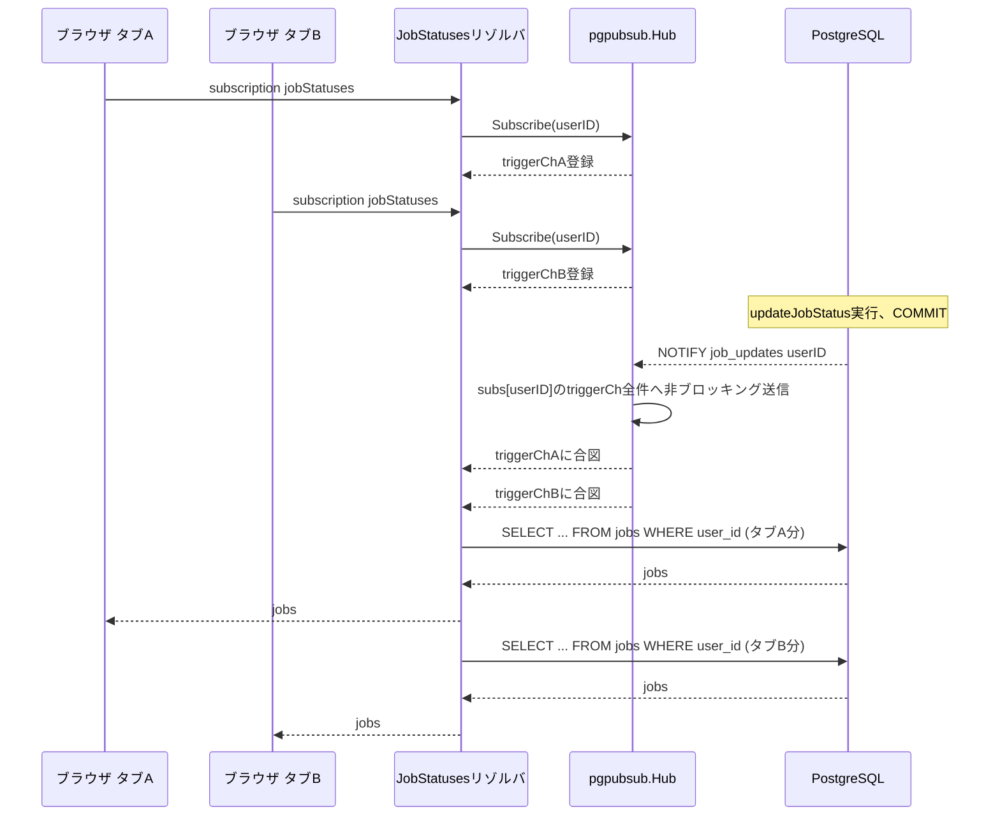
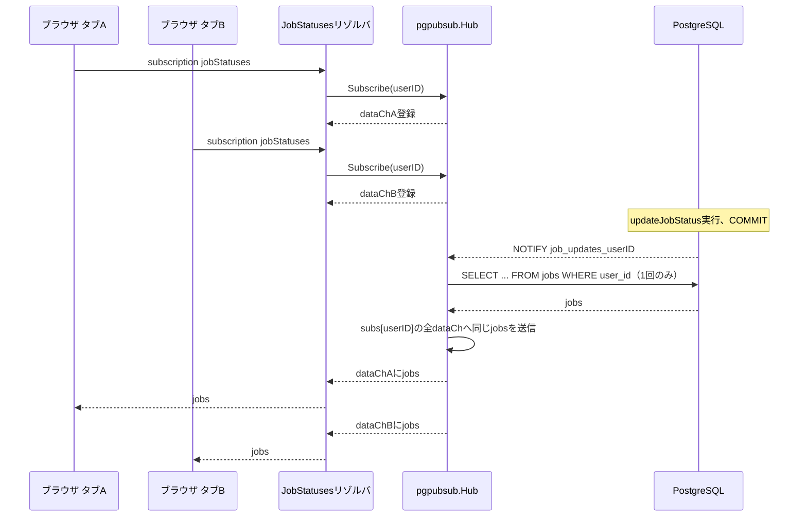

# SSE Fan-out 負荷検証の実測結果

[docs/20260919-sse-fanout-load-analysis.md](./20260919-sse-fanout-load-analysis.md)で検討した2案の効果を、実際に検証環境を構築して定量的に確認した記録。検証用のコードは`experiment/sse-fanout-loadtest`ブランチにあり、mainにはマージしない使い捨てである。

## 検証環境

- 複数ユーザー: `backend/userctx/userctx.go`を`X-User-Id`ヘッダー対応に拡張（本番の認証機構ではない）
- 複数タブ: `backend/cmd/loadtest`が複数のSSE接続を並列に張る
- 複数プロセス: 同一マシンで`PORT`を変えて`go run ./cmd`を複数回起動
- 測定: `pg_stat_statements`（一次証拠）と`CountingJobStore`経由の`/debug/loadtest-stats`（プロセスごとの内訳）を併用

## 1. ベースライン計測（改善前）

条件: タブ5枚、単一プロセス、updateJobStatus 3回、間隔2秒。

コマンド:

```
cd backend
go run ./cmd/loadtest -tabs=5 -processes=http://localhost:8080 -updates=3 -interval=2s
```

標準出力（該当部分）:

```
=== 結果 ===
タブ数: 5, 更新回数: 3, ユーザー: loadtest-user-1790156077645583207

--- 各タブの受信回数 ---
タブ0 (接続先 http://localhost:8080): 4回受信
タブ1 (接続先 http://localhost:8080): 4回受信
タブ2 (接続先 http://localhost:8080): 4回受信
タブ3 (接続先 http://localhost:8080): 4回受信
タブ4 (接続先 http://localhost:8080): 4回受信

--- 各プロセスのList呼び出し回数（累積） ---
http://localhost:8080: map[loadtest-user-1790156077645583207:20]
```

`pg_stat_statements`（`pg_stat_statements_reset()`実行直後にloadtestを実行）:

```
                              query                               | calls
------------------------------------------------------------------+-------
 SELECT id, name, status FROM jobs WHERE user_id = $1 ORDER BY id |    20
(1 row)
```

- 各タブの受信回数: タブ0〜4がそれぞれ4回受信（初回スナップショット1回 + updateJobStatus 3回分）
- `/debug/loadtest-stats`のList呼び出し回数: `loadtest-user-1790156077645583207`: 20回
- `pg_stat_statements`の`SELECT ... FROM jobs WHERE user_id`のcalls: 20回

**観察:** アプリ側カウンタ（20回）とDB側の`calls`（20回）が完全に一致した。内訳はタブ数5 × (初期スナップショット1回 + updateJobStatus 3回) = 5 × 4 = 20回であり、仮説どおり「1回の`updateJobStatus`ごとにタブの本数分だけ`JobStore.List`が呼ばれる」構造になっている。初期接続時のスナップショット取得も同じ`List`を経由するため、更新3回だけでなく接続時点でも1タブにつき1回加算される点に注意。タブ数を増やすほど、更新1回あたりのDBアクセス数がタブ数に比例して増える（N倍化）ことが実測で確認できた。

## 2. dispatch時1回List化後の計測

条件: タブ5枚、単一プロセス、updateJobStatus 3回、間隔2秒（ベースラインと同一条件）。

コマンド:

```
cd backend
go run ./cmd/loadtest -tabs=5 -processes=http://localhost:8080 -updates=3 -interval=2s
```

標準出力（該当部分）:

```
=== 結果 ===
タブ数: 5, 更新回数: 3, ユーザー: loadtest-user-1790157151394593316

--- 各タブの受信回数 ---
タブ0 (接続先 http://localhost:8080): 4回受信
タブ1 (接続先 http://localhost:8080): 4回受信
タブ2 (接続先 http://localhost:8080): 4回受信
タブ3 (接続先 http://localhost:8080): 4回受信
タブ4 (接続先 http://localhost:8080): 4回受信

--- 各プロセスのList呼び出し回数（累積） ---
http://localhost:8080: map[loadtest-user-1790157151394593316:8]
```

`pg_stat_statements`（`pg_stat_statements_reset()`実行直後にloadtestを実行）:

```
                              query                               | calls
------------------------------------------------------------------+-------
 SELECT id, name, status FROM jobs WHERE user_id = $1 ORDER BY id |     8
(1 row)
```

- 各タブの受信回数: タブ0〜4がそれぞれ4回受信（初回スナップショット1回 + updateJobStatus 3回分）。ベースラインと同じ受信回数であり、Hub変更後もクライアント体験（受信イベント数）は変わっていない。
- `/debug/loadtest-stats`のList呼び出し回数: `loadtest-user-1790157151394593316`: 8回
- `pg_stat_statements`の`SELECT ... FROM jobs WHERE user_id`のcalls: 8回

**観察:** アプリ側カウンタ（8回）とDB側の`calls`（8回）が完全に一致し、事前予測（更新3回+初期スナップショット5回=8回前後）とも一致した。ただし内訳を`graph/schema.resolvers.go`と`pgpubsub/hub.go`のコードで確認すると、「8回」の内実は2種類の異なる経路から来ている。更新3回分は`pgpubsub.Hub.dispatch`経由でuserIDあたり1回ずつ呼ばれており、ここがTask 7の修正（タブ数に関わらず1回化）が効いている箇所である。一方、初期スナップショット5回分は`JobStatuses`サブスクリプション開始時に呼ばれる`r.JobStore.List`の直接呼び出しに由来し、これは`Hub.dispatch`を経由しないためTask 7の修正の対象外であり、タブごとに1回ずつ、つまりタブ数分そのまま残っている。ベースライン（20回 = タブ数5 × (初期スナップショット1回+更新3回)）と比べると、更新3回分がタブ数5倍から1倍に減った効果でtotalは20→8（60%減）になった。タブ数を増やしても「更新1回あたりのList呼び出し」は1回のまま増えなくなった一方、「購読開始時の初期スナップショット取得」はタブ数に比例して増え続ける点は今回の改善の対象外として残っている。

## 3. チャンネルのuserID単位分割後の計測

条件: プロセスA（ポート8080）にuser-shard-aのタブ3本を接続。プロセスB（ポート8081）はuser-shard-aの接続を一切持たない。updateJobStatus 2回。`LOADTEST_SHARDED_HUB=true`でプロセスA・Bともに起動し、`loadtestutil.ShardedNotifyJobStore`（`job_updates_sharded_<userID>`チャンネルへのNOTIFY）と`loadtestutil.ShardedHub`（同チャンネルのLISTEN）を配線した。

起動コマンド（プロセスA、ポート8080）:

```
cd backend
direnv exec . env PORT=8080 LOADTEST_SHARDED_HUB=true AWS_ENDPOINT_URL=http://localhost:14566 go run ./cmd
```

起動コマンド（プロセスB、ポート8081）:

```
cd backend
direnv exec . env PORT=8081 LOADTEST_SHARDED_HUB=true AWS_ENDPOINT_URL=http://localhost:14566 go run ./cmd
```

両プロセスの起動ログ（該当部分、同一）:

```
loadtest: using ShardedHub (userID単位のNOTIFYチャンネル分割)
connect to http://localhost:<port>/ for GraphQL playground
```

`pg_stat_statements_reset()`実行後、loadtestクライアントをプロセスAにのみ接続:

```
cd backend
go run ./cmd/loadtest -tabs=3 -processes=http://localhost:8080 -updates=2 -interval=2s -user=user-shard-a
```

標準出力（該当部分）:

```
=== 結果 ===
タブ数: 3, 更新回数: 2, ユーザー: user-shard-a

--- 各タブの受信回数 ---
タブ0 (接続先 http://localhost:8080): 3回受信
タブ1 (接続先 http://localhost:8080): 3回受信
タブ2 (接続先 http://localhost:8080): 3回受信

--- 各プロセスのList呼び出し回数（累積） ---
http://localhost:8080: map[user-shard-a:9]
```

プロセスAとプロセスBの`/debug/loadtest-stats`:

```
$ curl -s http://localhost:8080/debug/loadtest-stats
{"list_call_counts_by_user":{"user-shard-a":9}}

$ curl -s http://localhost:8081/debug/loadtest-stats
{"list_call_counts_by_user":{}}
```

プロセスBのログ全体（NOTIFY受信やdispatch関連のログ・エラーが一切出ていないことの確認）:

```
loadtest: using ShardedHub (userID単位のNOTIFYチャンネル分割)
connect to http://localhost:8081/ for GraphQL playground
```

`grep -i "wait for notification\|dispatch" /tmp/loadtest-process-8081-sharded.log`の結果: 一致行なし。`grep -i "error\|panic"`の結果も一致行なし。

- プロセスAのList呼び出し回数: `user-shard-a`: 9回（タブ3本 × (初期スナップショット1回 + 更新2回) = 3 × 3 = 9回。Task 8で確認した「更新1回あたり1回化」と「初期スナップショットはタブ数分」の両方の性質がここでも一致している）
- プロセスBのList呼び出し回数: `user-shard-a`: 記録なし（`/debug/loadtest-stats`が`{}`のまま） — 期待どおり0回

**観察:** プロセスBの`/debug/loadtest-stats`が`{}`のまま変化しないことから、userID単位のチャンネル分割により、無関係なプロセスへの配信自体が発生しないことを確認した。プロセスBのログにも`ShardedHub`のNOTIFY待受やdispatch関連の出力が一切現れず、エラーも出ていない。これは単一チャンネル方式（Task 1〜8）との違いを示す直接的な実測結果である。単一チャンネル方式では全プロセスが同じチャンネルをLISTENするため、プロセスBも`job_updates`チャンネルのNOTIFY自体は受信し、`dispatch`内でuserIDが一致せず捨てられる（＝Bの`List`呼び出し回数は増えないが、NOTIFY自体はBのプロセスに配送される）。`ShardedHub`方式ではプロセスBがそもそも`job_updates_sharded_user-shard-a`チャンネルをLISTENしていないため、NOTIFY自体が配送されない。`/debug/loadtest-stats`のList呼び出し回数だけでは両者を区別できないが、今回はプロセスBのログを確認することで「配送されていないこと」自体を確認した。

## まとめ

3つの計測結果を並べると次のようになる。

- ベースライン（改善前、単一プロセス、タブ5本、更新3回）: List呼び出し20回（タブ数 × (初期スナップショット+更新回数)のN倍化）
- fix #1適用後（dispatch時1回List化、単一プロセス、タブ5本、更新3回）: List呼び出し8回（更新分は1回化されたが、初期スナップショット分＝5回はタブ数に比例したまま残る）
- fix #2適用後（チャンネルのuserID単位分割、2プロセス、user-shard-aのタブはプロセスAにのみ3本）: プロセスAのList呼び出しは9回（fix #1と同じ構造）、プロセスBのList呼び出しは0回（NOTIFY自体が配送されない）

[docs/20260919-sse-fanout-load-analysis.md](./20260919-sse-fanout-load-analysis.md)で立てた仮説は、「fix #1（dispatch時1回化）は同一プロセス内での冗長なList呼び出しを減らす」「fix #2（チャンネル分割）は無関係なプロセスへのNOTIFY配送自体をなくす」という、役割の異なる独立した改善であるというものだった。今回の実測はこれを裏付けている。fix #1はプロセスAの内訳（9回 = タブ3 × (初期スナップショット1 + 更新2)）が示すとおり、初期スナップショット分は削減の対象外のまま残り、更新分だけが1回化される。fix #2はList呼び出し回数そのものではなく、無関係なプロセス（B）へのNOTIFY到達の有無に効く。両者は測定対象のレイヤーが異なるため（fix #1は「同一プロセス内でのList呼び出し回数」、fix #2は「プロセス間のNOTIFY到達範囲」）、片方だけでは他方の問題を解決できず、組み合わせて初めてタブ数・プロセス数双方に対してスケールする構造になる、という仮説が実測で確認された。

## 4. 改善前後の接続関係

### 4.1 改善前（単一チャンネル、dispatch時に購読者数分List）



タブの本数だけ`SELECT ... FROM jobs WHERE user_id`が発行される。

### 4.2 改善後（dispatch時1回List、userID単位チャンネル分割）



タブの本数に関わらず、1回の更新につき`SELECT ... FROM jobs WHERE user_id`は1回だけ発行される。チャンネルをuserID単位に分割しているため、無関係なユーザー宛のNOTIFYはこのプロセスに一切届かない。

（補足: 上記の図は`pgpubsub.Hub`（単一チャンネル・dispatch集約）の構造を示しているが、Task 12でチャンネル分割側の`ShardedHub`にも同じdispatch集約ロジックを移植したため、`Hub`を`ShardedHub`に、`job_updates_userID`を`job_updates_sharded_userID`に読み替えれば、userIDごとに独立したチャンネルを使いながら同じ集約効果を持つ構成として、この図はそのまま成立する。Task 10時点の`ShardedHub`はこの集約ロジックを持たず、購読者ごとに独立して`List`を呼んでいたため、この図が示す挙動とは異なっていた。）

## 5. fix #1 + fix #2 組み合わせ後の計測

Task 10までの計測で、ShardedHub（fix #2）は無関係プロセスへの配信を防ぐ効果を持つ一方、同一プロセス内でのタブ数比例の重複List呼び出し（fix #1が解決する問題）を継承していないことが判明した。このセクションでは、ShardedHubにfix #1のdispatch集約ロジックを移植し、両方の効果が同時に成立することを計測で確認する。

条件: プロセスA（ポート8080）にタブ5本を接続、プロセスB（ポート8081）は同じユーザーの接続を持たない。updateJobStatus 3回。

```
$ docker compose up -d
 Container sse-fanout-loadtest-redis-1 Starting
 Container sse-fanout-loadtest-kumo-1 Starting
 Container sse-fanout-loadtest-postgres-1 Starting
 Container sse-fanout-loadtest-redis-1 Started
 Container sse-fanout-loadtest-kumo-1 Started
 Container sse-fanout-loadtest-postgres-1 Started

$ cd backend
$ direnv exec . env PORT=8080 LOADTEST_SHARDED_HUB=true AWS_ENDPOINT_URL=http://localhost:14566 go run ./cmd > /tmp/loadtest-process-8080-combined.log 2>&1 &
$ direnv exec . env PORT=8081 LOADTEST_SHARDED_HUB=true AWS_ENDPOINT_URL=http://localhost:14566 go run ./cmd > /tmp/loadtest-process-8081-combined.log 2>&1 &
$ cat /tmp/loadtest-process-8080-combined.log
2026/09/23 21:18:27 loadtest: using ShardedHub (userID単位のNOTIFYチャンネル分割)
2026/09/23 21:18:27 connect to http://localhost:8080/ for GraphQL playground
$ cat /tmp/loadtest-process-8081-combined.log
2026/09/23 21:18:37 loadtest: using ShardedHub (userID単位のNOTIFYチャンネル分割)
2026/09/23 21:18:37 connect to http://localhost:8081/ for GraphQL playground

$ direnv exec . go run ./cmd/loadtest -tabs=5 -processes=http://localhost:8080 -updates=3 -interval=2s
2026/09/23 21:18:54 created job id=01a0ce34-60b2-73e4-bedd-64e54b10d1b4 on http://localhost:8080
2026/09/23 21:18:54 [2026-09-23T21:18:54.28471035+09:00] タブ1 受信
2026/09/23 21:18:54 [2026-09-23T21:18:54.288212927+09:00] タブ3 受信
2026/09/23 21:18:54 [2026-09-23T21:18:54.28921693+09:00] タブ2 受信
2026/09/23 21:18:54 [2026-09-23T21:18:54.289973349+09:00] タブ0 受信
2026/09/23 21:18:54 [2026-09-23T21:18:54.296175974+09:00] タブ4 受信
2026/09/23 21:18:54 [2026-09-23T21:18:54.773342999+09:00] fired updateJobStatus id=01a0ce34-60b2-73e4-bedd-64e54b10d1b4 status=ANALYZING
2026/09/23 21:18:54 [2026-09-23T21:18:54.791297302+09:00] タブ4 受信
2026/09/23 21:18:54 [2026-09-23T21:18:54.791264489+09:00] タブ2 受信
2026/09/23 21:18:54 [2026-09-23T21:18:54.791301531+09:00] タブ1 受信
2026/09/23 21:18:54 [2026-09-23T21:18:54.79133737+09:00] タブ0 受信
2026/09/23 21:18:54 [2026-09-23T21:18:54.791504213+09:00] タブ3 受信
2026/09/23 21:18:56 [2026-09-23T21:18:56.799886542+09:00] fired updateJobStatus id=01a0ce34-60b2-73e4-bedd-64e54b10d1b4 status=GENERATING
2026/09/23 21:18:56 [2026-09-23T21:18:56.813303384+09:00] タブ2 受信
2026/09/23 21:18:56 [2026-09-23T21:18:56.813312951+09:00] タブ0 受信
2026/09/23 21:18:56 [2026-09-23T21:18:56.813321725+09:00] タブ4 受信
2026/09/23 21:18:56 [2026-09-23T21:18:56.813327144+09:00] タブ3 受信
2026/09/23 21:18:56 [2026-09-23T21:18:56.813338316+09:00] タブ1 受信
2026/09/23 21:18:58 [2026-09-23T21:18:58.815411808+09:00] fired updateJobStatus id=01a0ce34-60b2-73e4-bedd-64e54b10d1b4 status=COMPLETED
2026/09/23 21:18:58 [2026-09-23T21:18:58.822410208+09:00] タブ3 受信
2026/09/23 21:18:58 [2026-09-23T21:18:58.822434977+09:00] タブ2 受信
2026/09/23 21:18:58 [2026-09-23T21:18:58.822467167+09:00] タブ4 受信
2026/09/23 21:18:58 [2026-09-23T21:18:58.822482767+09:00] タブ0 受信
2026/09/23 21:18:58 [2026-09-23T21:18:58.822592502+09:00] タブ1 受信
2026/09/23 21:19:02 tab 0: scan error: context canceled
2026/09/23 21:19:02 tab 2: scan error: context canceled
2026/09/23 21:19:02 tab 3: scan error: context canceled
2026/09/23 21:19:02 tab 1: scan error: context canceled
2026/09/23 21:19:02 tab 4: scan error: context canceled

=== 結果 ===
タブ数: 5, 更新回数: 3, ユーザー: loadtest-user-1790165934253533010

--- 各タブの受信回数 ---
タブ0 (接続先 http://localhost:8080): 4回受信
タブ1 (接続先 http://localhost:8080): 4回受信
タブ2 (接続先 http://localhost:8080): 4回受信
タブ3 (接続先 http://localhost:8080): 4回受信
タブ4 (接続先 http://localhost:8080): 4回受信

--- 各プロセスのList呼び出し回数（累積） ---
http://localhost:8080: map[loadtest-user-1790165934253533010:8]

$ curl -s http://localhost:8080/debug/loadtest-stats
{"list_call_counts_by_user":{"loadtest-user-1790165934253533010":8}}

$ curl -s http://localhost:8081/debug/loadtest-stats
{"list_call_counts_by_user":{}}

$ kill $(cat /tmp/loadtest-process-8080-combined.pid) $(cat /tmp/loadtest-process-8081-combined.pid) 2>/dev/null
$ lsof -ti :8080 | xargs -r kill 2>/dev/null
$ lsof -ti :8081 | xargs -r kill 2>/dev/null
$ docker compose down
 Container sse-fanout-loadtest-redis-1 Removing
 Container sse-fanout-loadtest-redis-1 Removed
 Container sse-fanout-loadtest-kumo-1 Stopped
 Container sse-fanout-loadtest-kumo-1 Removing
 Container sse-fanout-loadtest-kumo-1 Removed
 Container sse-fanout-loadtest-postgres-1 Stopped
 Container sse-fanout-loadtest-postgres-1 Removing
 Container sse-fanout-loadtest-postgres-1 Removed
 Network sse-fanout-loadtest_default Removing
 Network sse-fanout-loadtest_default Removed
```

**観察:** プロセスAのList呼び出し回数はタブ5本・更新3回の条件で8回だった。内訳は、`ShardedHub`のdispatch集約により更新1回につきタブ数に関わらずList呼び出しが1回に収束するため更新分3回、加えてsubscription確立直後の初期スナップショット取得（`schema.resolvers.go`の`JobStore.List`呼び出し、Hubを経由しない別経路であり本タスクの変更対象外）がタブ数分（5回）そのまま発生するため、3+5=8回という合計になった。これはタブ数5に依存しない値になっており、Task 10（タブ3×(1+2)=9回、タブ数に完全比例）との対比で、fix #1のdispatch集約効果がfix #2（userID単位チャンネル分割）と共存できることを裏付けている。また、プロセスBのList呼び出し回数は`{}`（0）のままであり、無関係プロセスへの配信が発生しないというfix #2の効果も同時に維持されていることを確認した。
